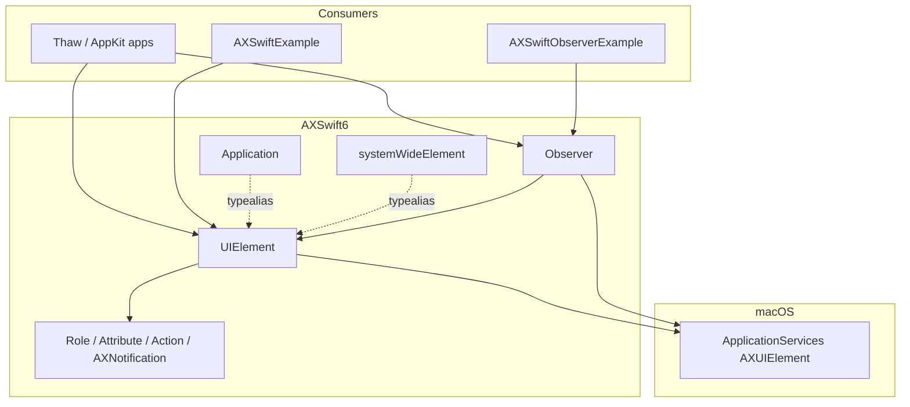
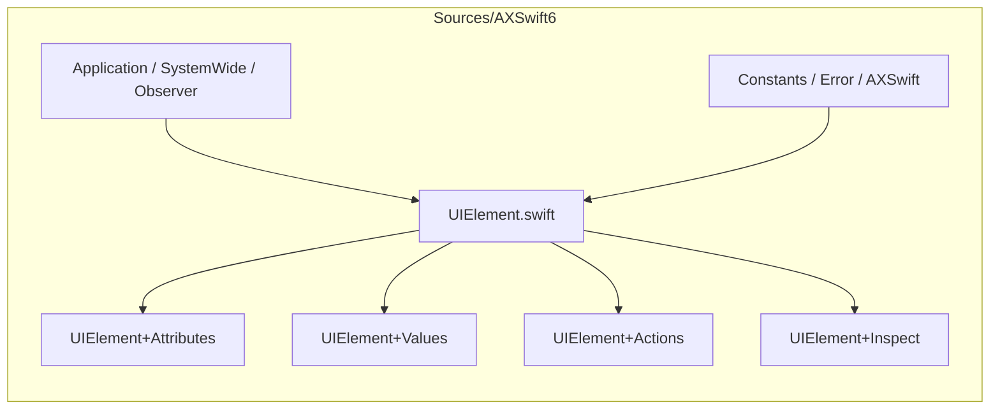

# AXSwift6

Swift 6 accessibility client API for macOS 26+.

Fork of [stonerl/AXSwift](https://github.com/stonerl/AXSwift) for [Thaw](https://github.com/thaw-app). Wraps Apple’s C `AXUIElement` APIs with a typed Swift surface, explicit errors, and `Sendable` handles that serialize access to the underlying unannotated Core Foundation references.

This package is a thin wrapper — not an accessibility object model. It translates types and error codes, and makes handles safe to use across concurrency domains.

## Requirements

- macOS 26+
- Swift 6 toolchain

## Architecture



| Type | Role |
|------|------|
| `UIElement` | Core handle: attributes, actions, messaging timeout, equality |
| `Application` | `UIElement` for a process (`forProcessID`, `all()`, `windows()`, …) |
| `systemWideElement` | Global AX element (focused app, hit-testing, …) |
| `Observer` | Run-loop notifications for an application’s UI |
| Constants | Typed `Role`, `Attribute`, `Action`, `AXNotification`, … |

## Layout

```text
Sources/AXSwift6/     Library (UIElement core + focused extensions)
Examples/             AppKit demos (package executables)
Tests/AXSwift6Tests/  Swift Testing
.github/workflows/    CI + release
```



## Install

```swift
// Package.swift
.package(url: "https://github.com/thaw-app/AXSwift6.git", from: "0.4.0"),
```

```swift
.product(name: "AXSwift6", package: "AXSwift6"),
```

```swift
import AXSwift6

guard checkIsProcessTrusted(prompt: true) else { return }

if let app = Application(forProcessID: somePID) {
    let role = try app.role()
    let windows = try app.windows()
}
```

Grant **Accessibility** permission to your process or AX calls return `AXError.apiDisabled` / `.notImplemented`.

## Examples

Requires Accessibility permission for the terminal / Xcode:

```bash
swift run AXSwiftExample           # query frontmost app, Finder, system-wide
swift run AXSwiftObserverExample   # watch Finder window notifications
```

## Develop

```bash
swift test
```

Tag a semver release (`1.2.3`) or run the **Release** workflow to publish a GitHub Release after tests pass.

## License

MIT — see [LICENSE](LICENSE).
